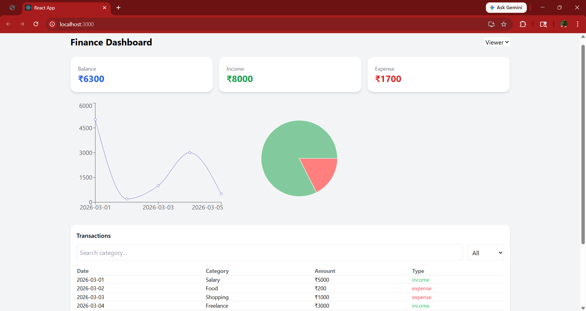

# Finance Dashboard UI

##  Project Overview
The Finance Dashboard UI is a frontend application built to help users track and analyze their financial activities. It provides a clean and interactive interface to view income, expenses, and overall balance.

---

## Features

-  Dashboard summary (Balance, Income, Expense)
-  Data visualization using charts (Line & Pie)
-  Transactions table with search and filter
-  Filter by Income / Expense
-  Role-based UI (Admin / Viewer)
-  Insights section (spending patterns)
-  Data persistence using LocalStorage
-  Responsive design

---

##  Technologies Used

- React.js
- JavaScript (ES6+)
- Tailwind CSS
- Recharts

---

##  Functionalities

- Dynamic calculation of balance, income, and expenses
- Search transactions by category
- Filter transactions based on type
- Role switching to simulate real-world access control
- Persistent data using browser localStorage

---

##  How to Run the Project

1. Clone the repository

```bash
git clone <your-repo-link>

2. Navigate to the project folder

cd finance-dashboard

3. Install dependencies

npm install

4. Start the application

npm start

## Dashboard Preview



